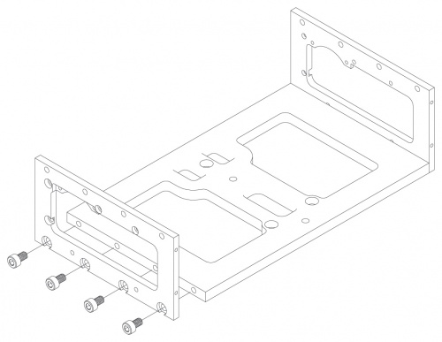
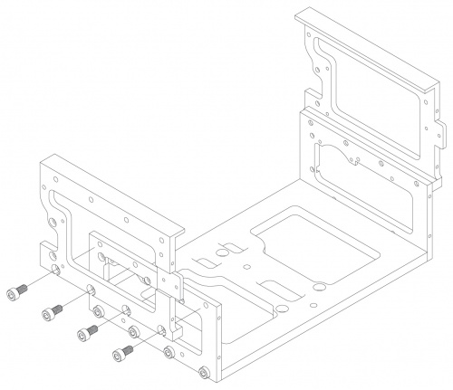
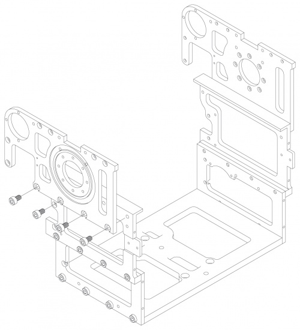
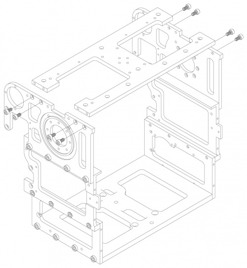
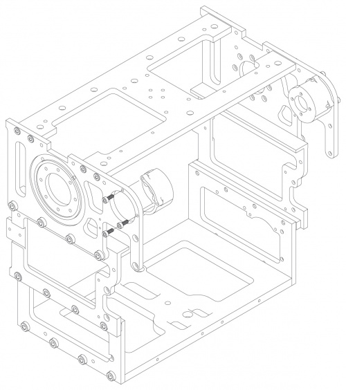
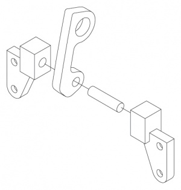
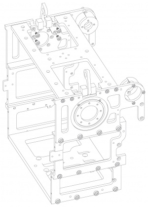

NEW DIVISIONS

1.  BOTTOM AND SIDE PLATES
2.  CENTRAL PLATE
3.  BACK PLATES
4.  HOOKS, TOP PLATE AND WIRE SUPPORT
5.  CHEST TO WAIST ATTACHMENT

WE NEED EXPLODED VIEWS FOR ALL OF THESE \[ALMOST EVERYTHING CHANGED\]

## Manual Accompaniment Video

<html>

<iframe width="640" height="510" src="http://www.youtube.com/embed/UbyqJiqvEbg" frameborder="0" allowfullscreen></iframe>

</html>


**Note:** If video does not appear, reload page.  

## Bottom and Lower Side Plates

<span style="color:#FF0000">**PLATE NEEDS RECADDING**</span>

### Hardware
```eval_rst
==== ========== ========= ======== ===========
Size Length(mm) Pitch(mm) Quantity 1:1
==== ========== ========= ======== ===========
M5   8          0.8       **8**    .. image:: M5x8.gif
==== ========== ========= ======== ===========
```

### Assembly

1.  Assemble chest bottom plate and lower side plates using four
*M5x8mm* screws for each side. Every element of the chest frame is
symmetric across HUBO's sagittal plane. See exploded view for
relative plate orientation.  

#### Exploded Views



Chest bottom and lower side plates **SP need recadding**              


## Central Side Plates

### Hardware

```eval_rst
==== ========== ========= ======== ===========
Size Length(mm) Pitch(mm) Quantity 1:1
==== ========== ========= ======== ===========
M5   10          0.8       **8**    .. image:: M5x10.gif
==== ========== ========= ======== ===========
```

### Assembly

1.  Attach central side plates using four *M5x10mm* screws for each
side. See exploded view for relative plate orientation.  


#### Exploded Views




Central Side Plate Attachment        

## Upper Side Plates

### Hardware

```eval_rst
==== ========== ========= ======== ===========
Size Length(mm) Pitch(mm) Quantity 1:1
==== ========== ========= ======== ===========
M5   8          0.8       **8**    .. image:: M5x8.gif
==== ========== ========= ======== ===========
```
### Assembly

1.  Attach central side plates using four *M5x8mm* screws for each
side. See exploded view for relative plate orientation.  

#### Exploded Views



Upper Side Plate Attachment

## Top Plate

### Hardware

```eval_rst
==== ========== ========= ======== ===========
Size Length(mm) Pitch(mm) Quantity 1:1
==== ========== ========= ======== ===========
M4   8          0.7       **8**    .. image:: M4x8.gif
==== ========== ========= ======== ===========
```
### Assembly

1.  Attach top plate using four M4x8mm screws for each side. See exploded view for relative plate orientation. Pay close attention to threaded holes in plate when orienting

#### Exploded Views



Top Plate Attachment


## Shoulder Pitch Motor Mounts

### Hardware

```eval_rst
==== ========== ========= ======== ===========
Size Length(mm) Pitch(mm) Quantity 1:1
==== ========== ========= ======== ===========
M3   8          0.5       **6**    .. image:: M3x8.gif
==== ========== ========= ======== ===========
```
### Assembly

1.  Attach shoulder motor mounts to inside of upper side plates using three M3x8mm screws for each side.

#### Exploded Views



Shoulder Pitch Motor Mount Attachment

## Frame Hangers

**ADD STOP THAT PREVENTS LOSING INSIDE HUBO??


### Hardware

```eval_rst
==== ========== ========= ======== ===========
Size Length(mm) Pitch(mm) Quantity 1:1
==== ========== ========= ======== ===========
M4      6       0.7       **8**    .. image:: M4x6.gif
==== ========== ========= ======== ===========
```
### Assembly

1.  The two hanger assemblies are each composed of the hanger, a pin and two end pieces for attachment to the chest frame. These pieces can be assembled as seen in the exploded view below.

2. Attach the hanger assemblies to the inside of the upper side plates using four M4x6mm screws for each.

#### Exploded Views



Frame Hanger Assembly



Frame Hanger Attachment

