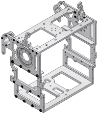

### Introduction

The chest houses the main computers for HUBO, battery, power
distribution board and shoulder motors and controllers.

### Section Contents

- [Chest: Before you start - Tools, Hardware and Components](chest-before-start)
- [Chest: Step-by-Step Disassembly](chest-step-by-step-disassembly)
- [Chest: Step-by-Step Assembly](chest-step-by-step-assembly)
