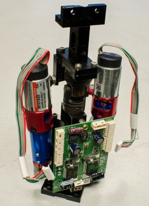

#### Introduction

The Neck contains one degree of freedom in the yaw direction and two
degrees of freedom in the roll direction, allowing the head to tilt from
shoulder to shoulder.

### Section Contents

- [Neck: Before you start - Tools, Hardware, and
Components](neck-before-start)
- [Neck: Step-by-Step
Disassembly](neck-step-by-step-disassembly)
- [Neck: Step-by-Step
Assembly](neck-step-by-step-assembly)
